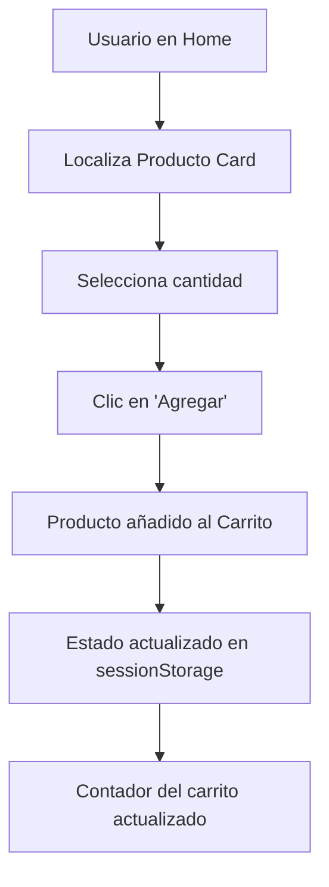
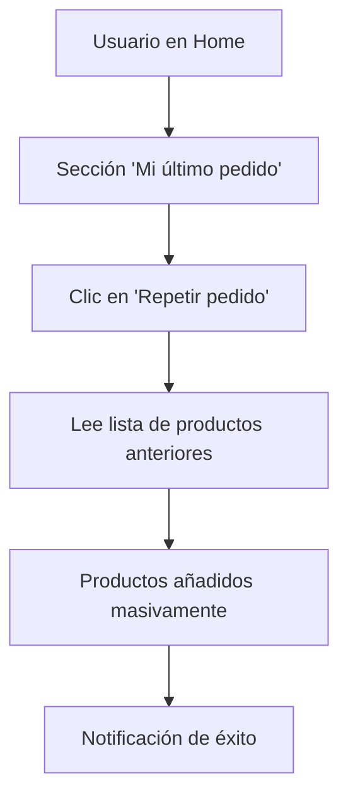
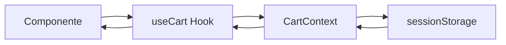

# 🛒 Mi Andina E-Commerce

<div align="center">
  
  
  
  
  
  
  **Una moderna aplicación de e-commerce diseñada para ofrecer una experiencia de compra fluida, rápida y personalizada.**
  
  *Construida desde cero utilizando las mejores prácticas del desarrollo Front-End con React.*
  
</div>

---

## 📋 Tabla de Contenidos

- [🎯 Visión del Proyecto](#-visión-del-proyecto)
- [🚀 Pila Tecnológica](#-pila-tecnológica-tech-stack)
- [✨ Características Principales](#-características-principales)
- [📁 Estructura del Proyecto](#-estructura-del-proyecto)
- [🏁 Primeros Pasos](#-primeros-pasos-getting-started)
- [🔄 Flujos de Aplicación Clave](#-flujos-de-aplicación-clave)
- [🗂️ Manejo de Estado](#️-manejo-de-estado)

---

## 🎯 Visión del Proyecto

El objetivo de **"Mi Andina"** es crear una interfaz de usuario (UI) de alto rendimiento, responsiva y mantenible, basada en los diseños de Figma proporcionados. La aplicación se centrará en una experiencia de usuario intuitiva, permitiendo a los clientes realizar sus compras de manera eficiente.

### 🎨 Características Destacadas
- ⚡ **Recompra rápida** y masiva de productos frecuentes
- 🔔 **Notificaciones personalizadas** para cada usuario
- 📱 **Diseño responsivo** adaptado a todos los dispositivos
- 🛍️ **Experiencia de compra optimizada**

> **Nota:** Este es un proyecto puramente Front-End. Toda la lógica de negocio y la persistencia de datos se simularán en el lado del cliente utilizando `sessionStorage` del navegador.

---

## 🚀 Pila Tecnológica (Tech Stack)

<div align="center">

| Tecnología | Versión | Propósito |
|------------|---------|-----------|
|  | 18+ | Framework principal para UI |
|  | Latest | Herramienta de build rápida |
|  | 5+ | Librería de componentes |
|  | Latest | Gestión de dependencias |

</div>

### 📊 Fuente de Datos
- **Simulada**: Archivo local `products.json` con información de productos

---

## ✨ Características Principales

### 🏠 **Home - Centro de Operaciones**
- 🎠 Carrusel de banners promocionales
- 🔄 **Pedido Purete**: Recompra inteligente y masiva
- ⭐ Listados de productos destacados y promociones
- 📦 **Repetir Pedido**: Acceso directo al último pedido

### 🛍️ **Producto Card**
Componente atómico y reutilizable que incluye:
- 🖼️ Imagen del producto
- 📝 Nombre y descripción
- 💰 Precio actualizado
- 🔢 Selector de cantidad
- ➕ Botón "Agregar al carrito"

### 🛒 **Carrito (Cart)**
- 🌐 Estado global persistente
- 💾 Almacenamiento en `sessionStorage`
- 🔄 Accesible desde toda la aplicación

### 🔔 **Sistema de Notificaciones**
- 📋 Vista dedicada de mensajes
- 🪟 Modal de notificación con detalles
- 🎯 Llamadas a la acción (CTA) directas

---

## 📁 Estructura del Proyecto

```
/src/
├── 📂 assets/              # Imágenes, fuentes y archivos estáticos
├── 📂 components/          # Componentes de UI reutilizables
│   ├── 📂 common/          # Componentes genéricos (Button, Input, Modal)
│   ├── 📂 layout/          # Componentes de estructura (Header, Footer, Sidebar)
│   ├── 📂 ProductoCard/    # Componente específico del Producto Card
│   └── ...
├── 📂 contexts/            # Contextos de React para estado global
│   └── 📄 CartContext.jsx  # Lógica y estado del Carrito de Compras
├── 📂 data/                # Archivos JSON con datos mock
│   └── 📄 products.json    # Base de datos de productos
├── 📂 hooks/               # Hooks personalizados
│   └── 📄 useCart.js       # Hook para interactuar con CartContext
├── 📂 pages/               # Componentes que actúan como vistas completas
│   ├── 📄 Home.jsx
│   ├── 📄 Notifications.jsx
│   └── 📄 Cart.jsx
├── 📂 styles/              # Estilos globales o temas de MUI
│   └── 📄 theme.js         # Definición del tema de Material-UI
├── 📄 App.jsx              # Componente raíz y configuración de rutas
└── 📄 main.jsx             # Punto de entrada de la aplicación
```

---

## 🏁 Primeros Pasos (Getting Started)

### 📋 Prerrequisitos

-  (versión 18 o superior)
-  o 

### ⚙️ Instalación

1. **Clona el repositorio:**
   ```bash
   git clone <URL_DEL_REPOSITORIO>
   cd mi-andina-app
   ```

2. **Instala las dependencias:**
   ```bash
   npm install
   # o si usas yarn:
   yarn install
   ```

3. **Ejecuta el servidor de desarrollo:**
   ```bash
   npm run dev
   # o si usas yarn:
   yarn dev
   ```

4. **¡Listo! 🎉**
   
   Abre tu navegador y visita `http://localhost:5173` para ver la aplicación en funcionamiento.

---

## 🔄 Flujos de Aplicación Clave

### 1. 🛍️ **Adición de un Producto al Carrito**



**Pasos detallados:**
1. 🏠 El usuario navega por la Home
2. 👀 Localiza un Producto Card de interés
3. 🔢 Utiliza el selector de cantidad
4. ➕ Hace clic en "Agregar"
5. 💾 El producto se añade al estado del Carrito
6. 🔄 El estado se actualiza en `sessionStorage`
7. 🔔 El contador del carrito se actualiza

### 2. 🔄 **Repetir un Pedido Anterior**



**Pasos detallados:**
1. 🏠 Usuario encuentra "Mi último pedido"
2. 🔄 Hace clic en "Repetir pedido"
3. 📋 La aplicación lee la lista simulada
4. 🛒 Productos añadidos masivamente al Carrito
5. ✅ Notificación de éxito al usuario

---

## 🗂️ Manejo de Estado

Para el estado global utilizamos la **API Context de React**, evitando el "prop drilling" y manteniendo un código limpio.

### 🎯 **CartContext.jsx**
- 📦 Centraliza el array de productos del carrito (`cartItems`)
- 🔧 Funciones de manipulación:
  - `addProduct()` - Añadir producto
  - `removeProduct()` - Eliminar producto
  - `updateQuantity()` - Actualizar cantidad
  - `clearCart()` - Limpiar carrito

### 💾 **Persistencia de Datos**
- 🔄 **Inicialización**: El `CartProvider` lee `sessionStorage` al montarse
- 💪 **Persistencia**: Garantiza continuidad durante la sesión del usuario
- 🎣 **Hook personalizado**: `useCart()` para acceso limpio al contexto

### 🔗 **Flujo de Estado**



---

<div align="center">
  
  **¡Gracias por tu interés en Mi Andina E-Commerce! 🚀**
  
  *Construyendo el futuro del comercio electrónico, un componente a la vez.*
  
</div>
